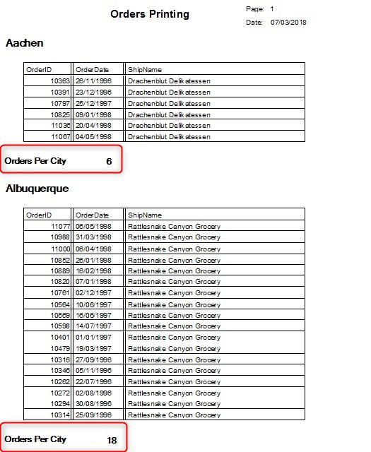

Keywords:batch, businessprocess, report, sections, groups

# Printing group footer for every ship city

<iframe width="560" height="315" src="https://www.youtube.com/embed/hqnUAz_GO_c?list=PL1DEQjXG2xnLss44EgCJq1bAM-Blgf2jd" frameborder="0" allowfullscreen></iframe>

---

Now that we have seen how to print a group header and control its printing, let's add a group footer that will display the number of orders from each city. We need to:
1. Add a "OrdersPerCity" NumberColumn that will store the number of orders
This column will be updated with 0 in the *GroupEnter* and accumulate its value in the *OnLeaveRow*
2. Add a *CitySuffix* layout section and place the "OrdersPerCity" column
3. Add the *GroupLeave* and add the WriteTo of the new section

```csdiff
+public readonly NumberColumn OrdersPerCity = new NumberColumn("Orders Per City");
public Print_Orders()
{
    Groups[Orders1.ShipCity].Enter += () =>
    {
        _layout.Customer.WriteTo(_ioPrint_Order);
+       OrdersPerCity.Value = 0;
    };
+   Groups[Orders1.ShipCity].Leave += () =>
+   {
+       _layout.GroupLeave.WriteTo(_ioPrint_Order);
+   };
}
protected override void OnLeaveRow()
{
+   OrdersPerCity.Value++;
    _layout.Body.WriteTo(_ioPrint_Order);
}
```

And this is the result:  
