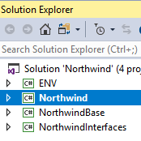
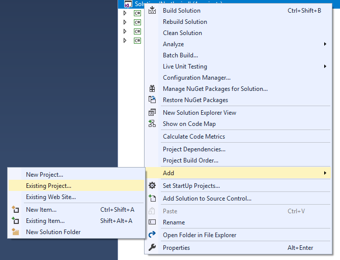

When working with the full solution (`Northwind full.sln`) Visual studio is loading all of your projects and this can cause a slow developer experiance.

The solution to that is working with a solution file that only contains the projects you are currently working on.

For that you can use the standard solution, called `Northwind.sln`, which by default contains only a few projects.

.

When you want to add an additional project, right click on the `solution` and choose `Add\Existing Project`

Choose the project folder `Northwind.Orders` for example and then choose the project file (`.csproj` file);

And you are ready to go.

### Usefuly Tip
You can have mutiple solutions files for the same source code - think of it as a workspace preference file.
Some developers have a solution file per module - or a solution file per developer

### Read More
To read more about Standard solutions VS full solutions see [standard-solution-vs-full-solution.html](standard-solution-vs-full-solution.html)