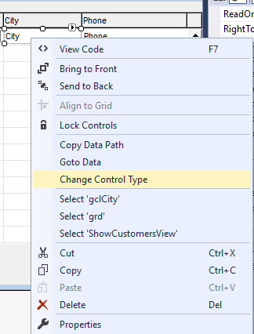
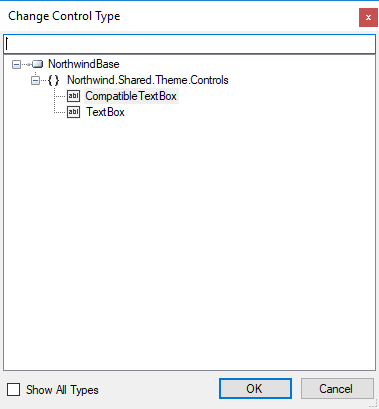
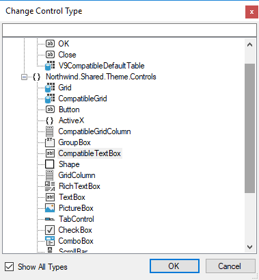

Keywords: changing control mode, changing control type

Right click on a control and select "Change Control Type"

Select the type you want in the Dialog

You can also change the fundamental type by checking the "Show All Types" check box

<iframe width="560" height="315" src="https://www.youtube.com/embed/TqWmsCoGH1E" frameborder="0" allowfullscreen></iframe>