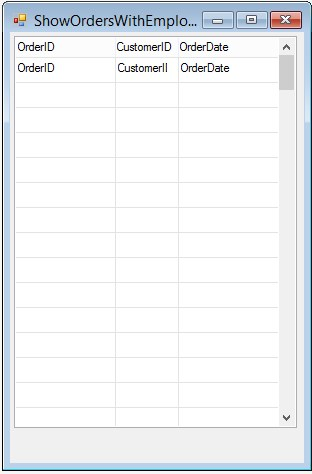
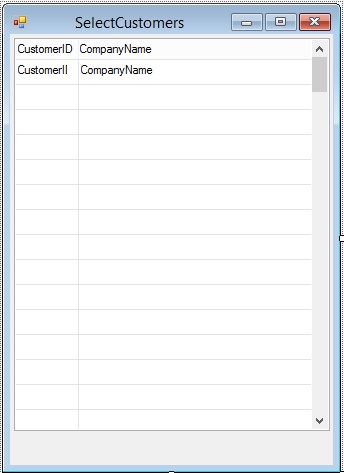

# Exercise - Create Selection List result

After item **6** Your **ShowOrdersWithEmployeeSelection** class should look like :
```csdiff
using System;
using System.Collections.Generic;
using System.Text;
using System.Drawing;
using Firefly.Box;
using ENV;
using ENV.Data;

namespace Northwind.Exercises.SelectionList
{
    public class ShowOrdersWithEmployeeSelection : UIControllerBase
    {
        public readonly Models.Orders Orders = new Models.Orders();


        public ShowOrdersWithEmployeeSelection()
        {
            From = Orders;
        }

        public void Run()
        {
            Execute();
        }

        protected override void OnLoad()
        {
            View = () => new Views.ShowOrdersWithEmployeeSelectionView(this);
        }
    }
}
```

After item **17** Your **SelectEmployees** class should look like :

```csdiff
using System;
using System.Collections.Generic;
using System.Text;
using System.Drawing;
using Firefly.Box;
using ENV;
using ENV.Data;
using System.Diagnostics;

namespace Northwind.Exercises.SelectionList
{
    public class SelectEmployees : UIControllerBase
    {

        public readonly Models.Employees Employees = new Models.Employees();

        public SelectEmployees()
        {
            From = Employees;
        }

        public void Run()
        {
            Execute();
        }

        protected override void OnLoad()
        {
            Activity = Activities.Browse;
            AllowDelete = false;
            AllowInsert = false;
            AllowUpdate = false;
            AllowSelect = true;
            View = () => new Views.SelectEmployeesView(this);
        }
        protected override void OnSavingRow()
        {
            Debug.WriteLine("Selecting Employee ID" + Employees.EmployeeID);
        }
    }
}
```


The **ShowOrdersWithEmployeeSelection** runtime should look like :  

  

The **SelectEmployees** runtime should look like : 


