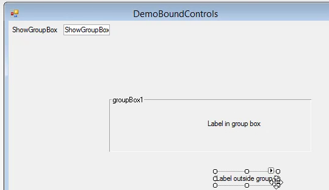
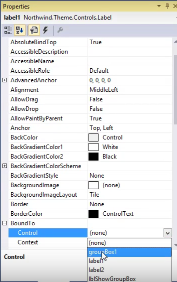

keywords: link to parent,BoundTo

* We can create a relationship between several controls and another control, so that when that control's visibility expression is changed, all the visibility of all the controls that are bound to that control will change accordingly.
* In this video we demo this behavior in magic, and demo how to achieve the same result in .NET
* Add a new UIContorller "DemoBoundControls" 
* We'll add a new local `BoolColumn` called "ShowGroupBox", we'll use it later as the visible expression of the GroupBox
```csdiff
public class DemoBoundContorls : UIContorllerBase
{
+   public readonly BoolColumn ShowGroupBox = new BoolColumn("Show Group Box");
...
}
``` 
* We'll add the "ShowGroupBox" column to the View
* We'll add a GroupBox and two labels to the View, and place one Label inside the GroupBox and another outside.  

* To bind the labels to the GroupBox, we'll go to the "Properties" window and select the `BoundTo` Property, in it we can select `groupBox1` as the bound to  `Control`.  

* We'll bind the visibility of the `groupBox1`to the "ShowGroupBox" column using the `BindVisibile` event in the "events" tab of the "Properties" window
```csdiff
private void groupBox1_BindVisible(object sender, BooleanBindingEventArgs e)
{
+   e.Value = _controller.ShowGroupBox;
}
```
* See how the visibility of the labels change together with the visibility of the GroupBox

<iframe width="560" height="315" src="https://www.youtube.com/embed/WKQrW2CBbOI?list=PL1DEQjXG2xnJAj9_s5itTMM-n7zpLKEnC" frameborder="0" allowfullscreen></iframe>