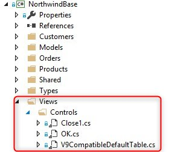
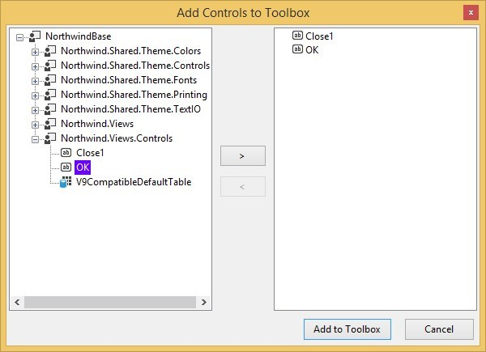

Keywords: Control, model, type, gui

# Control Models

So far we discussed Field models which are migrated as Types.  
In Magic you could also have GUI models, which are migrated as a user controls and could be found  
in the Views/Controls folder in the *Base* project:  

If you want to use them in your view you need to:
1. Open the view designer screen
2. In the toolbox right click on any tab and choose *Add Tab*
3. Provide it with a meaningful name, e.g. *MyControls*, and select it
4. On the view right click and choose *Add controls to toolbox*
5. Select your *Base* dll from your bin directory
6. In the opened screen expand the node with your controls, for example *Northwind.Views.Controls*

7. From here on you can use them as any other control 

---

<iframe width="560" height="315" src="https://www.youtube.com/embed/6y00crrV9dI?list=PL1DEQjXG2xnKZtXegLpuyGsdaxGh9dr9n" frameborder="0" allowfullscreen></iframe>