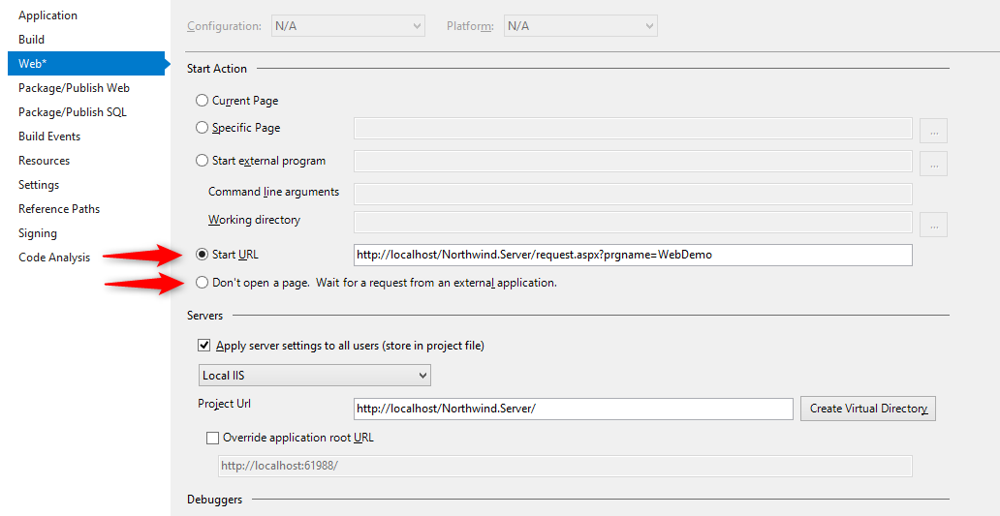

# Switch IIS Express To Local IIS

IIS Express is great for testing but in production you will be using the local IIS as your web server.  
To learn more about the Web Server types, please refer to [Web Servers in Visual Studio for ASP.NET Web Projects](https://msdn.microsoft.com/en-us/library/58wxa9w5(v=vs.120).aspx)  

Once your local IIS is installed, there are some settings need to made to support the migrated application.  
Please refer to [IIS Configuration](http://doc.fireflymigration.com/iis-configuration.html)

1) Open the properties of the web project (Northwind.Server) and go to the "Web" tab.  
2) Change the Server from "IIS Express" to "Local IIS"
3) Click on the button "Create Virtual Directory"

This will create a virutal application in the IIS named "Northwind.Server"

Since the IIS serves as an application server and always running in the background (w3wp.exe), you can run the Web Page without starting Visual Studio.  
If you wish to run it from Visual Studio (For debugging purposes), you can start visual studio without launching any browser or with launcing a specific URL:

