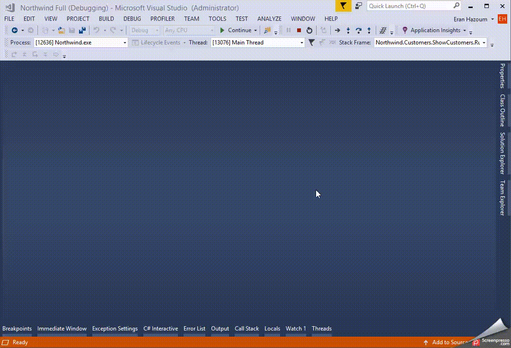
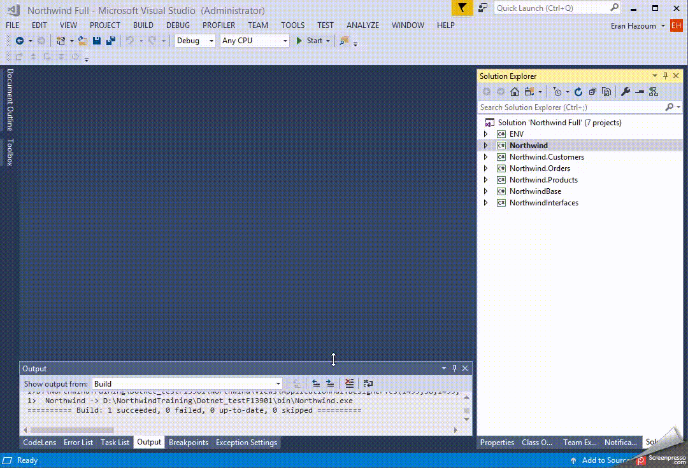
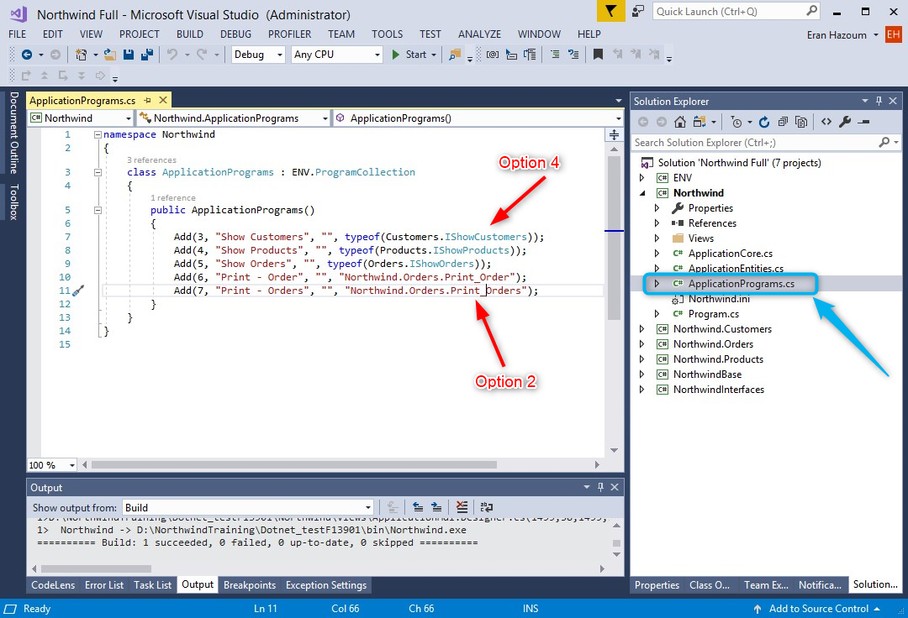

Here are some articles and techniques on how to find your controllers (programs) easily:
1. Use the (<kbd>Shift</kbd> + <kbd>F12</kbd>) keyboard shortcut while running the application to pause directly into the relevant code.  
    
       

By doing so you are shortening the search time for a program, and you are getting the code you need, using faster method, than tracking menus and tracking code 

See [using debug information in VS](using-debug-information-in-vs.html)

2. Use the <kbd>Ctrl</kbd> + <kbd>,</kbd> keyboard shortcut, to open visual studio's goto type dialog. (in vs 2015 it was <kbd>Ctrl</kbd> + <kbd>T</kbd>)  
       

3. While running the application use the Controller List developer tools (<kbd>Shift</kbd> + <kbd>F3</kbd>) and <kbd>Ctrl</kbd> + <kbd>T</kbd> keyboard shortcut.  
     
 
see: [finding a controller using the developer tools and find type](finding-a-controller-using-the-developer-tools-and-find-type.html)

4. Right click on any class and choose `Goto Definition` to go to it's code. <kbd>F12</kbd>. If it's an `interface` you can choose `Goto Implementation` to go to the actual controller's code.  
     

5. In the entry point project, there is a class called `ApplicationPrograms` that lists all programs with their number and class info.  
You can use one of this options to go the code :  
 option 2 : if the name of the class appears as text.
 option 4 : `Goto Implementation`  

6. If you get an error report from your users with the call stack, use the [stack trace explorer](stack-trace-explorer.html) visual studio extension to go directly from it to your code.

7. Once you break into the code, use the Visual Studio's `CallStack` window to browse through the running controllers and double click any line to go to it's code. you can find the `CallStack` window the "Debug\Windows\CallStack" menu

## Some more navigation related articles
1. Goto code from the designer: [going to an expression from the designer](going-to-an-expression-from-the-designer.html)

2. Working with the small and fast standard solution: [using the standard solution](using-the-standard-solution.html)

We hope you'll find this useful