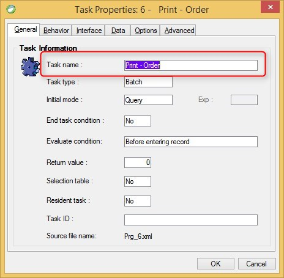

keywords: Title, task properties
# Task Name

Name in Migrated Code: **Title**   
Location in Migrated Code: **Constructor**  



Notes  
  The task name is migrated to a Class Name. In the migrated code, the original name is also preserved for backward compatibility reasons (Such as the Prog function) in the Title Property.

Example :
```csdiff
public ShowOrders()
{   //... other code
    Title = "ShowOrders";
    // other code
}
```
---
**See Also**

* [UIController Title ](http://www.fireflymigration.com/reference/html/P_Firefly_Box_UIController_Title.htm)
* [Business Process Title](http://www.fireflymigration.com/reference/html/P_Firefly_Box_BusinessProcess_Title.htm)

--- 