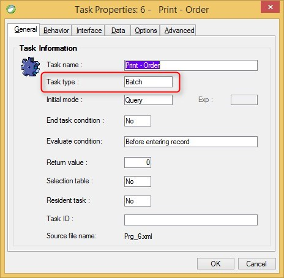

keywords:UIController, BusinessProcess,FlowUIController, task properties
# Task Type

The Task Type in Magic is either Online or Batch. In the migrated code, online Tasks convert to Classes which inherit from the UIController Class, while Batch tasks convert to Classes which inherit from the BusinessProcess Class.

Name in Migrated Code: **UIController, BusinessProcess**  
Location in Migrated Code: **Class**  



## Values:

| Magic Name | Migrated Code Name      |
|------------|-------------------------|
| Batch                    | BusinessProcessBase |
| Online (no record main)  | UIControllerBase    |
| Online (with record main)| FlowUIControllerBase|
| Browser                  | NA                  |
| Rich Client              | NA                  |


## Example BusinessProcess:
```csdiff
+internal class Print_Order : BusinessProcessBase 
{
}
```
## Example UIController:
```csdiff
+internal class Show_Order :UIControllerBase 
{
}
```
## Example FlowUIController:
```csdiff
+internal class Show_Order : FlowUIControllerBase 
{
}
```
---
**See Also:**
- [UIController Class](http://fireflymigration.com/reference/html/T_Firefly_Box_UIController.htm.htm)
- [BusinessProcess Class](http://fireflymigration.com/reference/html/T_Firefly_Box_BusinessProcess.htm)
- [UIController Class Members](http://www.fireflymigration.com/reference/html/AllMembers_T_Firefly_Box_UIController.htm)
- [Business Process Class Members](http://www.fireflymigration.com/reference/html/AllMembers_T_Firefly_Box_BusinessProcess.htm)
---