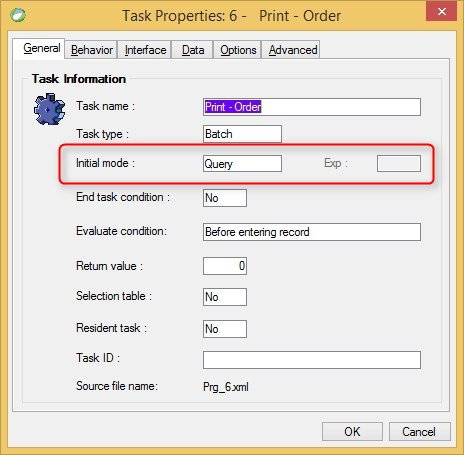

keywords:Activity, u.ActivityOfParent, u.TranslateTaskActivity, Query, Modify, Create, Delete, Browse, Update, Insert, onload, task properties
# Initial Mode

Name in Migrated Code: **Activity**  
Location in Migrated Code: **OnLoad Method**



## Values:

| Magic Name | Migrated Code Name      |
|------------|-------------------------|
| Query      | Browse                  |
| Modify     | Update (default)        |
| Create     | Insert                  |
| Delete     | Delete                  |
| As Parent  | u.ActivityOfParent      |
| By Exp     | u.TranslateTaskActivity |

## Example: Browse:
```csdiff
protected override OnLoad()
{   
+   Activity = Activities.Browse;
}

```
## Example: By Parent:
```csdiff
protected override OnLoad()
{   
+    Activity = u.ActivityOfParent;    
}
```
## Example: By Expression:
```csdiff
protected override OnLoad()
{   
+    Activity =  u.TranslateTaskActivity(u.If(1==1,"Q","M"));     
}
```

---
**See Also:**

- [UIController Activity Property](http://fireflymigration.com/reference/html/P_Firefly_Box_UIController_Activity.htm)
- [BusinessProcess Activity Property](http://fireflymigration.com/reference/html/P_Firefly_Box_BusinessProcess_Activity.htm)
- [Activities Enum](http://fireflymigration.com/reference/html/T_Firefly_Box_Activities.htm)

---
