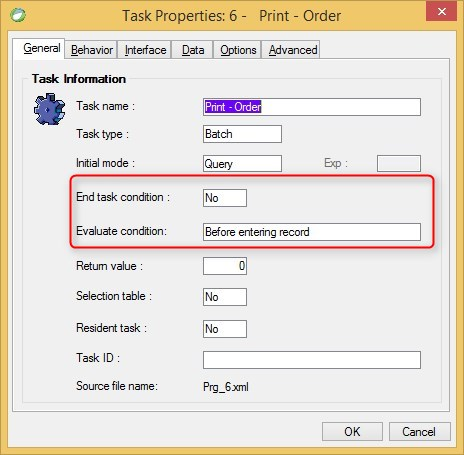

Keywords:exit,checkexit,BindExitAsSoonAsPossible,onload, task properties
# End Task Condition, Evaluate Condition for End Task

Name in Migrated Code: **Exit**  
Location in Migrated Class: **OnLoad Method**  



## Evaluate condition Values:  

| Magic Name                            | Migrated Code Name |
|---------------------------------------|--------------------|
| Before Entering Record                | BeforeRow          |
| After Updating Record                 | AfterRow           |
| Immediately when condition is Changed | AsSoonAsPossible   |

## Example: Exit Before Row with no expression:
```csdiff
protected override void OnLoad()
{
+    Exit(ExitTiming.BeforeRow);
}
```
## Example: Exit Before Row with an expression:
```csdiff
protected override void OnLoad()
{
+    Exit(ExitTiming.BeforeRow, () => Orders.ShipCity == "London");
}
```
## Example: Exit After Row with no expression:
```csdiff
protected override void OnLoad()
{
+    Exit(ExitTiming.AfterRow);
}
```
## Example: Exit After Row with an expression:
```csdiff
protected override void OnLoad()
{
+    Exit(ExitTiming.AfterRow, () => Orders.ShipCity == "London"));
}
```

## Example: BindExitAsSoonAsPossible
In most cases this exit condition will be translated to:

```csdiff
protected override void OnLoad()
{
+    BindExitAsSoonAsPossible(() => Orders.ShipCity == "London", Orders.ShipCity);
}

```

## Notes:
* The first argument is the condition.
* The other arguments are columns that upon their change, the controller should reevaluate the Exit Condition.
---
**See Also:**

- [UIController Exit Method + examples](http://www.fireflymigration.com/reference/html/M_Firefly_Box_UIController_Exit.htm)
- [BusinessProcess Exit Method + examples](http://fireflymigration.com/reference/html/M_Firefly_Box_BusinessProcess_Exit.htm)
- [Exit Method Overloads](http://www.fireflymigration.com/reference/html/Overload_Firefly_Box_BusinessProcess_Exit.htm)

---