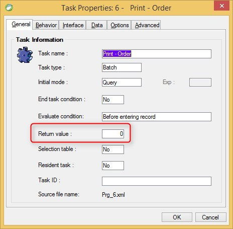

keywords:task properties, onunload
# Return Value

Name in Migrated Code: **return _taskresult**  
Location in Migrated Code: **Run Method**  



## Example:
```csdiff
class batchToCalculateSum : BusinessProcessBase 
{
   readonly NumberColumn var1 = new NumberColumn("var1", "2");
   readonly NumberColumn var2 = new NumberColumn("var2", "2");
   Number _taskResult;
   public batchToCalculateSum()
   {
     Columns.Add(var1);
     Columns.Add(var2);
 
     public Number Run()
     {
            Execute();
+            return _taskResult;
      }
      protected override void OnUnLoad()
      {
+            _taskResult = var1 + var2;
      }
    }
}
```
The migrated code will calculate the return expression in the onUnLoad method and will set it to a member called _taskResult, which will be used as the return value of the Run method.

---
