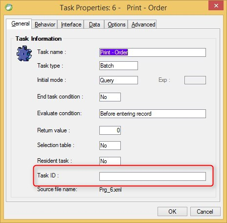

keywords: task properties, onload, task id
# Task ID

Name in Migrated Code: **TaskID**   
Location in Migrated Code: **Constructor**   


## Example:
```csdiff
public MyProgram()
{
    Title = "MyProgram";
+    TaskID = "MyProgramID";
    InitializeDataView();
}

```

---