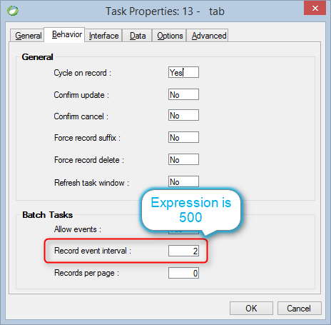

keywords: Task Properties, Behavior Tab, Record event interval, Interval

Name in migrated code: **UserInterfaceRefreshRowsInterval**  
Location in migrated code: **OnLoad**



## Migrated Code Example

The **Batch Tasks** group is enabled in a BusinessProcess class (Batch task)

```csdiff   
protected override void OnLoad()
{
+    UserInterfaceRefreshRowsInterval = 500;
}
```        


