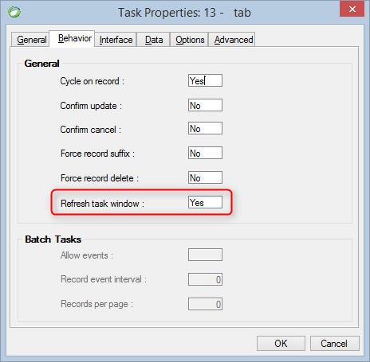

keywords: Task Properties, Behavior Tab, Refresh,Refresh task window, Reload Data



## Migrated Code Example
```csdiff   
protected override void OnLoad()
{
+    ReloadDataAfterSavingRow = true;

}
```        
Condition as an expression:

```csdiff   
protected override void OnLoad()
{
+     BindReloadDataAfterSavingRow(() => ENV.Security.UserManager.CurrentUser.Name == "SUPERVISOR");BindReloadDataAfterSavingRow(() => ENV.Security.UserManager.CurrentUser.Name == "SUPERVISOR");
}
```        


## Property Values
True or false. The default is **false** which is Refresh task window = No in Magic

## See Also
[UIController ReloadDataAfterSavingRow](http://www.fireflymigration.com/reference/html/P_Firefly_Box_UIController_ReloadDataAfterSavingRow.htm)

