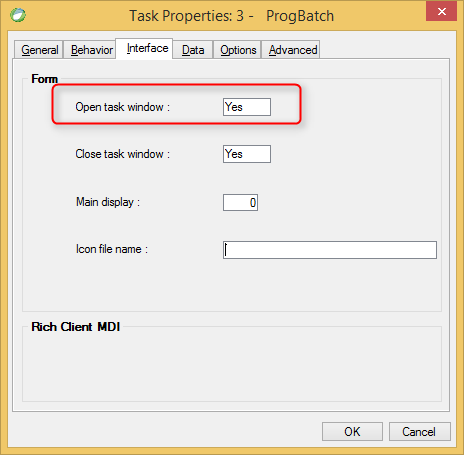

keywords: Task Properties, Interface Tab, Open task window 

Name in migrated code: **View**  
Location in migrated code: **OnLoad**




## Migrated Code Example


```csdiff   
protected override void OnLoad()
{
+    View = () => new Views.OrdersView(this);
}
``` 

When the property is set to No - the View property is not defined    


## Notes
In UIController (Online program in Magic) - The View property is defined by default  
In BusinessProcess (Batch program in Magic) - The View property is not defined by degault
       
