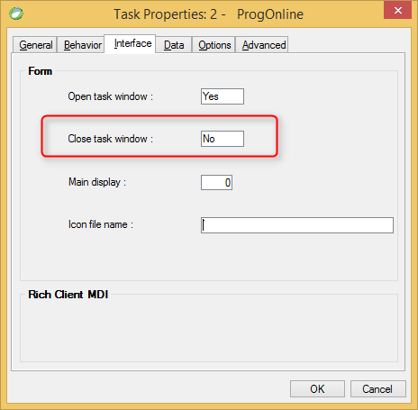

keywords: Task Properties, Interface Tab, Close task window 

Name in migrated code: **KeepViewVisibleAfterExit**  
Location in migrated code: **OnLoad**



## Migrated Code Example


```csdiff   
protected override void OnLoad()
{
+    KeepViewVisibleAfterExit = true;
}
```        


Condition as an expression:

```csdiff   
protected override void OnLoad()
{
+     BindKeepViewVisibleAfterExit(() => !(ENV.Security.UserManager.CurrentUser.Name == "SUPERVISOR"));
}
```        

## Property Values
True or false. The default is **True** which is Close task window = Yes in Magic