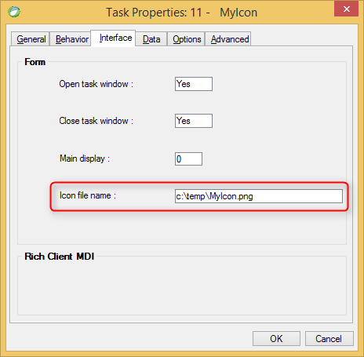

keywords: Task Properties, Interface Tab, Icon file name 

Name in migrated code: **Icon**  
Location in migrated code: **OnLoad**



## Migrated Code Example


```csdiff   
protected override void OnLoad()
{
+    Icon = @"c:\temp\MyIcon.png";
}
```        
## Property Values
String of the icon file path