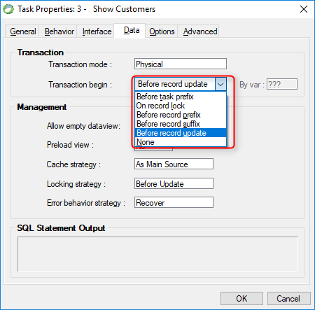

keywords: Task Properties, Data Tab, Transaction Begin, OnLoad, TransactionScope, On record lock, RowLocking, Before record rrefix, Before task prefix, Before record update, SaveToDatabase

Name in Migrated Code: **Transaction Scope**  
Location in Migrated Code: **OnLoad Method**  

 

## Migrated Code Example 

```csdiff
protected override void OnLoad()
{
+   TransactionScope = TransactionScopes.RowLocking; 
    View = () => new Views.ShowOrdersView(this);
}
```

## Property Values 

| Magic Name          | Migrated Code Name |
|---------------------|--------------------|
| Before Task Prefix  | Task               |
| OnRecordLock        | RowLocking         |
| BeforeRecordPrefix  | Row                |
| BeforeRecordSuffix  | LeaveRow           | 
| Before Record Update| SaveToDataBase     | 
| None                | None               | 
| Group               | Group              | 

The default is Transaction begin = **None** in Magic

## Note
The Group option is only applicable for BusinessProcess. The migrated code will not write the `TransactionScope` property if no transaction is required.
The `TransactionScope` property will be written whenever a transaction was set - even if it was the default in magic. 
It does that to explicitly indicate that there is a transaction.

## See Also: 
* [UIController TransactionScope](/reference/html/P_Firefly_Box_UIController_TransactionScope.htm) 
* [BusinessProcess TransactionScope ](/reference/html/P_Firefly_Box_BusinessProcess_TransactionScope.htm) 
* [TransactionScope Enum](/referencehtml/T_Firefly_Box_TransactionScopes.htm) 
