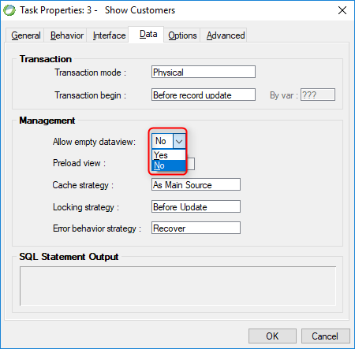

keywords: Task Properties, Data Tab, Allow empty dataview, OnLoad

Name in migrated Code: **SwitchToInsertWhenNoRows**  
Location in migrated Code: **OnLoad**  

 


## Migrated Code Example

```csdiff   
protected override void OnLoad()
{
+   SwitchToInsertWhenNoRows = true;
    View = () => new Views.ShowOrdersView(this);
}
```  

## Property Values

True or false.
For a UIController the default is false.
For a FlowUIController the default is true.


## See Also
* [UIController.SwitchToInsertWhenNoRows](/reference/html/P_Firefly_Box_UIController_SwitchToInsertWhenNoRows.htm) 
