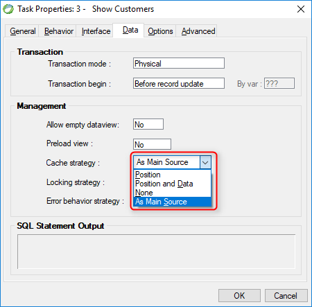

keywords: Task Properties, Data Tab, Cache Strategy, Cached

Location in Migrated Code: **Models**  

 

## Migrated Code Example

```csdiff 
+ readonly Models.Products Products = new Models.Products { Cached = true};
```

## Property Values

| Magic Name          | Migrated Code Name                |
|---------------------|-----------------------------------|
| Position            |  ReuseSelectResultOnPaging = true |
| Position and Data   |  Cached = true                    |
| None                |  Cached = false                   |
| As Main source      |          -                        | 

The default is Cached Strategy= **As Main Source** in Magic

## Note 
The cache strategy that will be used for any specific table is determined by the property defined with the entity definition in the Class.  

## See Also
* [Entity.Cached](/reference/html/P_Firefly_Box_Data_Entity_Cached.htm)


