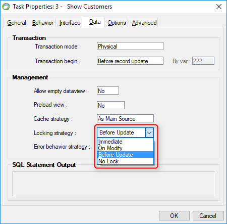

keywords: Task Properties, Data Tab, Locking Strategy, Rowlocking, OnLoad 

Name in Migrated Code: **Rowlocking**  
Location in Migrated Code: **OnLoad Method**  

 


## Migrated Code Example 

Immediate example :    
```csdiff
protected override void OnLoad()
{
+   RowLocking = LockingStrategy.OnRowLoading; 
+   ReevaluateBindValueAndRelationsOnEnterRow = true;
    View = () => new Views.ShowOrdersView(this);
}

```
On Modify example:
```csdiff
protected override void OnLoad()
{
    RowLocking = LockingStrategy.OnUserEdit;
    View = () => new Views.ShowOrdersView(this);
}
```


## Property Values 

| Magic Name          | Migrated Code Name | 
|---------------------|--------------------|
| No Lock             | None               | 
| Immediate           | OnRowLoading       |
| Before Update       | OnRowSaving        | 
| On Modify           | OnUserEdit         | 

The default is Locking strategy = **No Lock** in Magic


## Note

Note: The migrated code will not write the `RowLocking` property if no locking is required.  
The `RowLocking` property will be written whenever a locking is used - even if it was the default in magic.   
It does that to explicitly indicate that there is locking.  

## See Also: 
* [UIController LockingStrategy Property](http://www.fireflymigration.com/reference/html/P_Firefly_Box_UIController_RowLocking.htm) 
* [BusinessProcess LockingStrategy Property](http://www.fireflymigration.com/reference/html/P_Firefly_Box_BusinessProcess_RowLocking.htm)
* [LockingStrategy Enum](http://www.fireflymigration.com/reference/html/T_Firefly_Box_LockingStrategy.htm)


### LockCurrentRow

#### Note
If the Locking Strategy is “On Modify” in Magic (LockingSTrategy.OnUserEdit) then it may be necessary when calling a task or program to specify that the current record with all its links must be locked.    
This may be specified in Magic by clicking Ctrl+P on the call task or call program line, and specifying the lock as 'Yes' in the dialog that appears. To support this functionality, the LockCurrentRow method is employed.    
 

#### Migrated Code Example 
```csdiff
if(V_counter == 1) 
{ 
    LockCurrentRow(); 
    new ProgramName(this).Run(); 
}  
```

#### See Also: 
* [UIController LockCurrentRow Method](http://www.fireflymigration.com/reference/html/M_Firefly_Box_UIController_LockCurrentRow.htm) 
* [BusinessProcess LockCurrentRow Method](http://www.fireflymigration.com/reference/html/M_Firefly_Box_BusinessProcess_LockCurrentRow.htm) 
