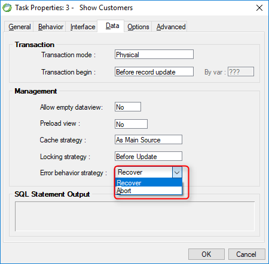

keywords: Task Properties, Data Tab, Error behavior strategy, OnLoad

Name in Migrated Code: **OnDatabaseErrorRetry**  
Location in Migrated Code: **OnLoad Method**  

 

## Migrated Code Example 

Error behavior strategy = abort
```csdiff 
OnDatabaseErrorRetry = false; 
```

## Property Values

| Magic Name          | Migrated Code Name | 
|---------------------|--------------------|
| Recover             | true               | 
| Abort               | false              |

The default is false which is Error behavior strategy = **Abort** in Magic

## See Also:
* [UIController OnDatabaseError Property](/reference/html/P_Firefly_Box_UIController_OnDatabaseErrorRetry.htm) 
* [BusinessProcess OnDatabaseError Property](/reference/html/P_Firefly_Box_BusinessProcess_OnDatabaseErrorRetry.htm) 
