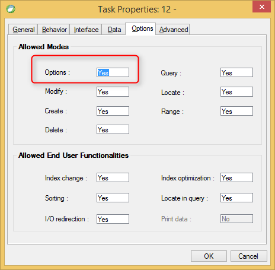

keywords: Task Properties, Options Tab, Options, Allow options 

Name in migrated code: **AllowActivitySwitch**  
Location in migrated code: **OnLoad**




## Migrated Code Example


```csdiff   
protected override void OnLoad()
{
+    AllowActivitySwitch = false;
}
``` 

    


## Property Values
True or false. The default is **True** which is Allow Options = Yes in Magic
       