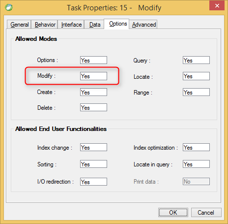

keywords: Task Properties, Options Tab, Modify, Allow Modify, Update 

Name in migrated code: **AllowUpdate**  
Location in migrated code: **OnLoad**




## Migrated Code Example


```csdiff   
protected override void OnLoad()
{
+    AllowUpdate = false;
}
``` 

    
Condition as an expression:

```csdiff   
protected override void OnLoad()
{
+     BindAllowUpdate(() => ENV.Security.UserManager.CurrentUser.Name == "SUPERVISOR");
}
```        


## Property Values
True or false. The default is **True** which is Allow Update = Yes in Magic
     

---
**See Also**  
[AllowUpdate ](http://www.fireflymigration.com/reference/html/P_Firefly_Box_UIController_AllowUpdate.htm)  
[BindAllowUpdate ](http://www.fireflymigration.com/reference/html/M_Firefly_Box_UIController_BindAllowUpdate.htm)

---        