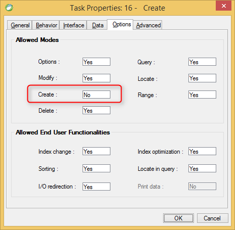

keywords: Task Properties, Options Tab, Create, Allow Create

Name in migrated code: **AllowInsert**  
Location in migrated code: **OnLoad**



## Migrated Code Example


```csdiff   
protected override void OnLoad()
{
+    AllowInsert = false;
}
``` 

    


## Property Values
True or false. The default is **True** which is Allow Create = Yes in Magic
       