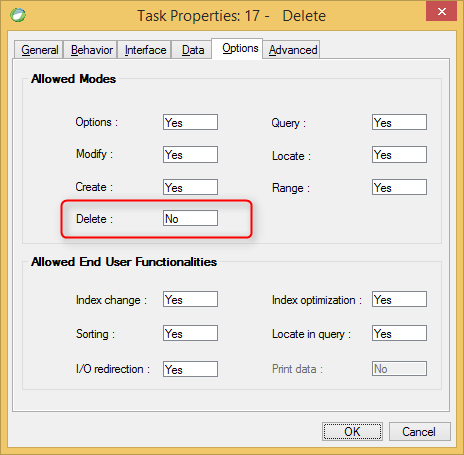

keywords: Task Properties, Options Tab, Create, Allow Create

Name in migrated code: **AllowDelete**  
Location in migrated code: **OnLoad**



## Migrated Code Example


```csdiff   
protected override void OnLoad()
{
+    AllowDelete = false;
}
``` 

Condition as an expression:

```csdiff   
protected override void OnLoad()
{
+     BindAllowDelete(() => ENV.Security.UserManager.CurrentUser.Name == "SUPERVISOR");
}
```        
    


## Property Values
True or false. The default is **True** which is Allow Delete = Yes in Magic
       

---
**See Also**  
[AllowDelete ](http://www.fireflymigration.com/reference/html/P_Firefly_Box_UIController_AllowDelete.htm)  
[BindAllowDelete ](http://www.fireflymigration.com/reference/html/M_Firefly_Box_UIController_BindAllowDelete.htm)

---   