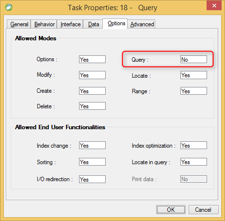

keywords: Task Properties, Options Tab, Query, Allow Query

Name in migrated code: **AllowBrowse**  
Location in migrated code: **OnLoad**




## Migrated Code Example


```csdiff   
protected override void OnLoad()
{
+    AllowBrowse = false;
}
``` 

    


## Property Values
True or false. The default is **True** which is Allow Query = Yes in Magic
       