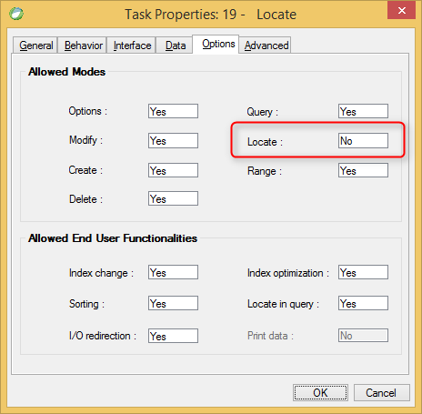

keywords: Task Properties, Options Tab, Locate, Allow Locate

Name in migrated code: **AllowFindRow**  
Location in migrated code: **OnLoad**




## Migrated Code Example


```csdiff   
protected override void OnLoad()
{
+    AllowFindRow = false;
}
``` 

Condition as an expression:

```csdiff   
protected override void OnLoad()
{
+     BindAllowFindRow(() => ENV.Security.UserManager.CurrentUser.Name == "SUPERVISOR");
}
```        
    


## Property Values
True or false. The default is **True** which is Allow Locate = Yes in Magic