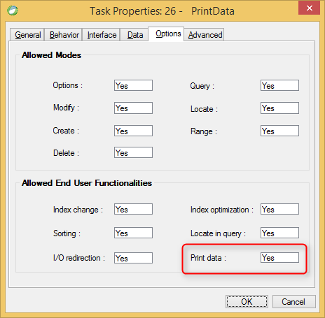

keywords: Task Properties, Options Tab, Print data, 

Name in migrated code: **AllowExportData**  
Location in migrated code: **OnLoad**



## Migrated Code Example


```csdiff   
protected override void OnLoad()
{
+    AllowExportData = true;
}
``` 

Condition as an expression:

```csdiff   
protected override void OnLoad()
{
+     BindAllowExportData(() => ENV.Security.UserManager.CurrentUser.Name == "SUPERVISOR");
}
```            


## Property Values
True or false. The default is **False** which is Allow Print data = No in Magic