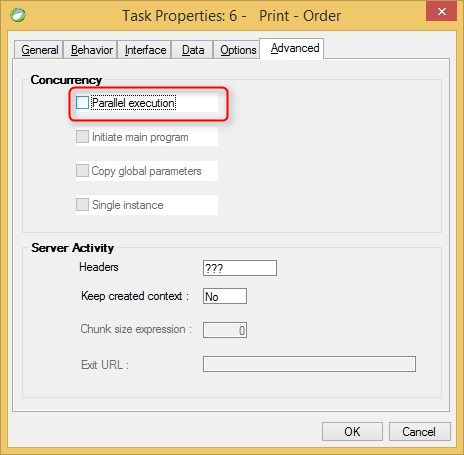

keywords: task properties, advanced, parallel
# Parallel Execution

Name in Migrated Code: **[className]Async**   
Location in Migrated Code: **a separate class**



Whenever a program (batch / online) is defined as Parallel in Magic,  
the migrated code will have two classes for the same program:
1. The class representing the migrated code (the program logic)
2. A class with the same name + **Async**, representing the fact that  
this class is executed in parallel (Asynchronously).
Every call to this program will be done via this class.
The program iself is called in the Run() method.

Example :
```csdiff
    public class MyProgramAsync : AsyncHelperBase 
    {
        public MyProgramAsync()
        {
        }
        /// <summary>MyProgram(P#2)</summary>
        public string Run()
        {
            return RunAsync<MyProgram>(c => c.Run());
        }
    }

```
---
