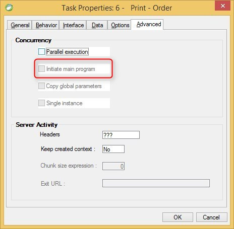

keywords: task properties, advanced, initiate
# Initiate Main Program

Name in Migrated Code: **DisableApplicationStart**  
Location in Migrated Code: **Asynch class constructor**



In case this checkbox is not checked in the source code, 
this property will appear in the migrated code.

## Example:
```csdiff
    public class MyProgram2Async : AsyncHelperBase 
    {
        public MyProgram2Async()
        {
            DisableApplicationStart = true;
        }
    }

```
---
