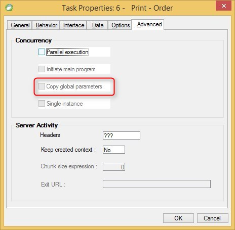

keywords: task properties, advanced, global parameters
# Copy Global Parameters

Name in Migrated Code: **CopyParametersInMemory**  
Location in Migrated Code: **Asynch class constructor**



Example :
```csdiff
    public class MyProgram2Async : AsyncHelperBase 
    {
        public MyProgram2Async()
        {
            CopyParametersInMemory = true;
        }
    }

```
---
