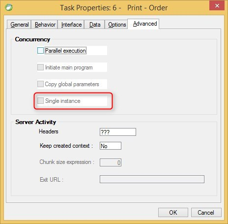

keywords: task properties, advanced, single instance
# Single Instance

Name in Migrated Code: **SingleInstance**  
Location in Migrated Code: **Asynch class constructor**



## Example:
```csdiff
    public class MyProgram2Async : AsyncHelperBase 
    {
        public MyProgram2Async()
        {
            SingleInstance = true;
        }
    }

```
---
