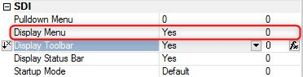

keywords: task forms, SDI, Display Menu
# SDI - Display Menu

Name in Migrated Code: **property set to false**  
Location in Migrated Code: **OnControllerLoad() methods of the view class**  



## Example :
```csdiff
protected override void OnControllerLoad()
{
+   SetContainerForm(() => new ApplicationSDI(), false);
}

```


