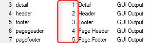

keywords: task forms, GUI Output, GUI class

# GUI Output class

Name in Migrated Code: **_layoutC[ClassNumber]**  
Location in Migrated Code: **BusinessProcess class**  



## Example :
```csdiff
protected override void OnControllerLoad()
{
+Printing.PrintCustomersC1 _layout { get { return Cached<Printing.PrintCustomersC1>(); } }
+Printing.PrintCustomersC2 _layoutC2 { get { return Cached<Printing.PrintCustomersC2>(); } }
+Printing.PrintCustomersC3 _layoutC3 { get { return Cached<Printing.PrintCustomers3>(); } }
+Printing.PrintCustomersC4 _layoutC4 { get { return Cached<Printing.PrintCustomersC4>(); } }
+Printing.PrintCustomersC5 _layoutC5 { get { return Cached<Printing.PrintCustomersC5>(); } }
}
```

> In case there are more than one form in the same class, they will be united into the same View class