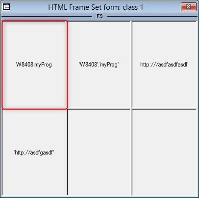

keywords: task forms, frameset, frame

# Frameset Frame

Name in Migrated Code: ****  
Location in Migrated Code: **Constructor**  



## Example :
```csdiff
public myFrameSet()
{
+    var HtmlFrame = new Shared.Theme.IO.Html.HtmlFrame() { Height = 180, Width = 400 };
+    var a = new Shared.Theme.IO.Html.HtmlFrame() { Height = 180, Name = "a", Vertical = true, Width = 133 };
+    HtmlFrame.Frames.Add(a);
}
```

> 1. Each set of frames are wrapped in a larger frame - in this case frame a (marked in Red) is wrapped in HtmlFrame.  
> 2. Each containing frame will have the Frames.Add of all the contained frames.
> 3. Depending on the orientation of the frame, the property Vertical = true will appear (the default is false).
