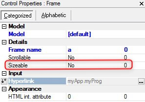

keywords: task forms, frameset, frame sizeable

# Frameset Frame Sizeable

Name in Migrated Code:   **Resize**  
Location in Migrated Code: **Frame**  



## Example :
```csdiff
public myFrameSet()
{
-    var a = new Shared.Theme.IO.Html.HtmlFrame() { Height = 180, Name = "a", Vertical = true, Width = 133 };
+    var a = new Shared.Theme.IO.Html.HtmlFrame() { Height = 180, Name = "a", Vertical = true, Width = 133, Resize = true };
}
```