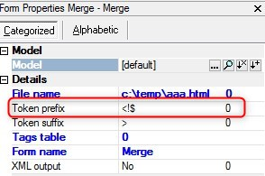

keywords: task forms, HTML Merge, Token prefix

# Token prefix expression

Name in Migrated Code: **TokenPrefix**   
Location in Migrated Code: **OnLoad**  



## Example :
```csdiff
+   _viewMerge.TokenPrefix = u.RTrim("pref");

```
> In case the program uses the default prefix (<!$), the above will not be added