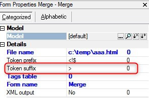

keywords: task forms, HTML Merge, Token suffix

# Token suffix expression

Name in Migrated Code: **TokenSuffix**   
Location in Migrated Code: **OnLoad**  



## Example :
```csdiff
+   _viewMerge.TokenSuffix = u.RTrim("suff");

```
> In case the program uses the default prefix (>), the above will not be added