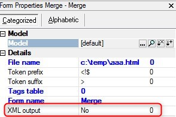

keywords: task forms, HTML Merge, XML output

# XML output

Name in Migrated Code: **ReplaceXmlSpecialCharacters**   
Location in Migrated Code: **OnLoad**  



## Example:
```csdiff
+   _viewMerge.ReplaceXmlSpecialCharacters = true;
```

## Example expression:
```csdiff
-   _viewMerge.ReplaceXmlSpecialCharacters = true;
+   _viewMerge.ReplaceXmlSpecialCharacters = a != "";
```
