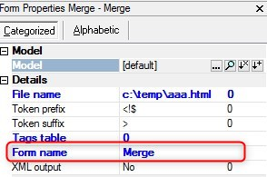

keywords: task forms, HTML Merge, form name

# HTML Merge form name

Name in Migrated Code: **_view[FormName]**  
Location in Migrated Code: **OnLoad**  



## Example:
```csdiff
internal class PrintCustomers : BusinessProcessBase 
{
+    _viewMerge = new TextTemplate(@"c:\temp\myTemplate.html");
}
```


