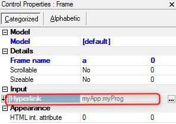

keywords: task forms, frameset, frame hyperlink

# Frameset Frame Hyperlink

Name in Migrated Code:   **Resize**  
Location in Migrated Code: **Frame**  



## Example program:
```csdiff
public myFrameSet()
{
+    var a = new Shared.Theme.IO.Html.HtmlFrame() { Height = 180, Name = "a", Vertical = true, Width = 133 };
+   a.BindUrl(() => u.CreatePublicNameUrl("myProg"));
}
```
> Arguments to the called program will appear after the program name, separated with commas.

## Example URL:
```csdiff
public myFrameSet()
{
+    var c1 = new Shared.Theme.IO.Html.HtmlFrame() { Height = 180, Name = "c", Url = "http://myURL", Vertical = true, Width = 135 };
}
```
## Example URL as expression:
```csdiff
public myFrameSet()
{
+    var d = new Shared.Theme.IO.Html.HtmlFrame() { Height = 180, Name = "d", Vertical = true, Width = 133 };
+    d.BindUrl(() => "http://muURL");
}
```
