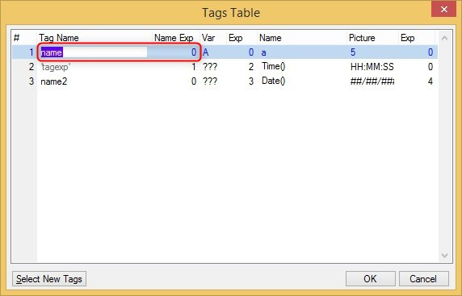

keywords: task forms, HTML Merge, tage name

# Tag name

Name in Migrated Code: **Tag**   
Location in Migrated Code: **OnLoad**  



## Example :
```csdiff
+        _viewMerge.Add(
+            	new Tag("name", a), 
```
## Example name expression:
```csdiff
+        _viewMerge.Add(
-            	new Tag("name", a), 
+            	new Tag(() => "tagexp", a), 
```
