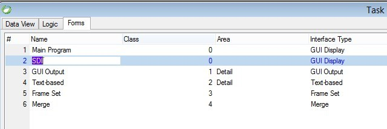

# Forms

The following articles explain the different form types in the migrated code:  
  

> In online tasks most of the properties can be edited using the designer, so they were not referred to in the articles.