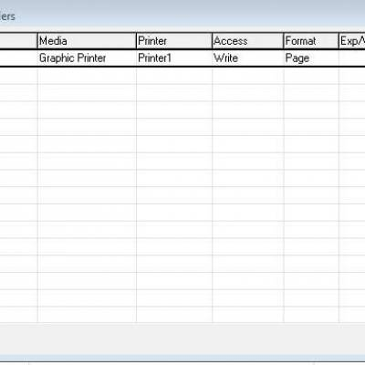

# Comparison with eDeveloper's I/O Files Dialog Box

## Introduction
In this article we will look at the 'I/O Files' screen as it appears in eDeveloper (version 9) and show the equivalent representation of each setting and property in the migrated code.

Let's look at the eDeveloper I/O Files screen, used for defining I/O for printing to a printer device or for reading and writing to a file:



The properties section looks like this:


The actual output or input device is determined in Magic by the Media property. The following table specifies the different Media defined in Magic and their .Net counterparts in the migrated code.

| No 	| Media Type                 	| Name in migrated code                       	|
|----	|----------------------------	|---------------------------------------------	|
| 1. 	| Graphic Printer            	| PrinterWriter                               	|
| 2. 	| Printer                    	| TextPrinterWriter                           	|
| 3. 	| Console                    	| PrinterWriter with PrintPreview set to true 	|
| 4. 	| File with Access Write     	| FileWriter                                  	|
| 5. 	| File with Access Read      	| FileReader                                  	|
| 6. 	| Requester                  	| WebWriter                                   	|
| 7. 	| XML Direct Access          	| XML                                         	|
| 8. 	| Variable with Access Write 	| ByteArrayWriter                             	|
| 9. 	| Variable with Access Read  	| ByteArrayReader                             	|

Each section below will list the relevant Methods and Properties for each Media type:

---

## Graphic Printer
To work with a graphic printer in migrated code, use the PrinterWriter class. 
For a comprehensive overview of all properties and methods in this class, see: PrinterWriter Methods and Properties

The following sub sections describe the migrated code usage for the options and properties of PrinterWriter.

### Name

Name in Migrated Code: **Name** <br>
Location in Migrated Code: **OnLoad Method** <br>
###### Example:
```csdiff
_ioPrint_Order = new ENV.Printing.PrinterWriter()
{
    Name = "PrintOrders",
};
```
##### See Also :
* [Name property](http://www.fireflymigration.com/reference/html/P_Firefly_Box_Printing_PrinterWriter_Name.htm) 

### Printer

Name in Migrated Code: **PrinterName** <br>
Location in Migrated Code: **OnLoad Method** 
###### Example:

```csdiff
_ioPrint_Order = new ENV.Printing.PrinterWriter()
{   
    PrinterName = Shared.Printing.Printers.Mdpst1.PrinterName,
};
```
##### See Also :
* [PrinterName Property](http://www.fireflymigration.com/reference/html/P_Firefly_Box_Printing_PrinterWriter_PrinterName.htm) 

### Exp/Var

Name in Migrated Code: Name of a File is passed in the PrinterWriter constructor <br>
Location in Migrated Code: **OnLoad Method** 
###### Example:
```csdiff
_ioPrint_Order = new ENV.Printing.PrinterWriter(vFileName)
{
    // code
};
```

##### See Also :
* [FileName Property](http://www.fireflymigration.com/reference/html/P_Firefly_Box_Printing_PrinterWriter_FileName.htm) 


### Properties

#### PDLG

Name in Migrated Code: **PrintDialog**<br>
Location in Migrated Code: **OnLoad Method**
###### Example:
```csdiff
_ioPrint_Order = new ENV.Printing.PrinterWriter()
{
    PrintDialog = true,
};
```

##### See Also :
* [PrintDialog Property](http://www.fireflymigration.com/reference/html/P_Firefly_Box_Printing_PrinterWriter_PrintDialog.htm) 


#### Paper Size

Name in Migrated Code: **PaperKind** <br>
Location in Migrated Code: **OnLoad Method**
###### Example:
```csdiff
_ioPrint_Order = new ENV.Printing.PrinterWriter()
{
    PaperKind = System.Drawing.Printing.PaperKind.A4,
};
```
##### See Also :
* [PaperKind Property](http://www.fireflymigration.com/reference/html/P_Firefly_Box_Printing_PrinterWriter_PaperKind.htm)  
* [PaperKind Enum](http://msdn.microsoft.com/en-us/library/d06f4sht)  

#### Page Header Form

Name in Migrated Code: **PageHeader** <br>
Location in Migrated Code: **OnLoad Method**
###### Example:
```csdiff
_ioPrint_Order = new ENV.Printing.PrinterWriter()
{
    PageHeader = _layout.HeaderLayout,
};
```

##### See Also :
* [PageHeader Property](http://www.fireflymigration.com/reference/html/P_Firefly_Box_Printing_PrinterWriter_PageHeader.htm)  

Note: For more information regarding _layout, see:[ReportLayout Class](http://www.fireflymigration.com/reference/html/T_Firefly_Box_Printing_ReportLayout.htm)


#### Page Footer Form

Name in Migrated Code: **PageFooter** <br>
Location in Migrated Code: **OnLoad Method**
###### Example:
```csdiff
_ioPrint_Order = new ENV.Printing.PrinterWriter()
{
    PageFooter = _layout.FooterLayout,
    //other code
};
```

##### See Also :
* [PageFooter Property](http://www.fireflymigration.com/reference/html/P_Firefly_Box_Printing_PrinterWriter_PageFooter.htm)  
Note: For more information regarding _layout, see:[ReportLayout Class](http://www.fireflymigration.com/reference/html/T_Firefly_Box_Printing_ReportLayout.htm)


#### Copies and Copies Expression

Name in Migrated Code: **Copies** <br>
Location in Migrated Code: **OnLoad Method** 
###### Example:
```csdiff
_ioPrint_Order = new ENV.Printing.PrinterWriter()
{
    Copies = 1,
};
```
###### Example Expression:
```csdiff
_ioPrint_Order = new ENV.Printing.PrinterWriter()
{
    Copies = Exp_1(),
};
```
##### See Also :
* [Copies Property](http://www.fireflymigration.com/reference/html/P_Firefly_Box_Printing_PrinterWriter_Copies.htm)  

#### Orientation

Name in Migrated Code: **Landscape** <br>
Location in Migrated Code: **OnLoad Method** 
###### Example:
```csdiff
_ioPrint_Order = new ENV.Printing.PrinterWriter()
{
    LandScape = true,
};
```
##### See Also :
* [Landscape Property](http://fireflymigration.com/reference/html/P_Firefly_Box_Printing_PrinterWriter_Landscape.htm)  


#### Print Preview

Name in Migrated Code: **PrintPreview** <br>
Location in Migrated Code: **OnLoad Method**
###### Example:
```csdiff
_ioPrint = new ENV.Printing.PrinterWriter()
{
    PrintPreview = true,
};
```

##### See Also :
* [PrintPreview Property](http://www.fireflymigration.com/reference/html/P_Firefly_Box_Printing_PrinterWriter_PrintPreview.htm)  


## Printer

Example: IN the Class, define an object:

```ENV.Printing.TextPrinterWriter _ioText;```

The following lists the migrated code equivalents for the Printer Options and Properties:

### Name

Name in Migrated Code: **Name** <br>
Location in Migrated Code: **OnLoad Method** 
###### Example:
```csdiff
_ioPrint_Order = new ENV.Printing.TextPrinterWriter()
{
    Name = "PrintFormattedOrders",
};
```

### Printer

Name in Migrated Code: **Printer** <br>
Location in Migrated Code: **OnLoad Method**
###### Example:
```csdiff
_ioPrint_Order = new ENV.Printing.TextPrinterWriter()
{
    Printer = Shared.Printing.Printers.Printer1,
};
```

### Format

Name in Migrated Code: **IgnoreNewPage**<br>
Location in Migrated Code: **OnLoad Method** 
###### Example:
```csdiff
_ioPrint_Order = new ENV.Printing.TextPrinterWriter()
{
    IgnoreNewPage = true,
};
```

---

### Exp/Var

Name in Migrated Code: Name of a File is passed in the TextPrinterWriter constructor  <br>
Location in Migrated Code: **OnLoad Method** 
###### Example:
```csdiff
_ioTextPrint = new ENV.Printing.TextPrinterWriter("%TextPrinterFileName%")
{
    // code
};
```

### Rows

Name in Migrated Code: **LinesPerPage**<br>
Location in Migrated Code: **OnLoad Method** 
###### Example:
```csdiff
_ioTextPrint = new ENV.Printing.TextPrinterWriter("%PRN_PORT%")
{
	Printer = Shared.Printing.Printers.Printer1,
	LinesPerPage = 60,
};
_ioTextPrint.Open();
```

### Properties

#### Flip Lines

Name in Migrated Code: **PerformRightToLeftManipulations** <br>
Location in Migrated Code: **OnLoad Method** 
###### Example:
```csdiff
_ioTextPrint = new ENV.Printing.TextPrinterWriter("%PRN_PORT%")
{
	Printer = Shared.Printing.Printers.Printer1,
	PerformRightToLeftManipulations = true;
};
_ioTextPrint.Open();
```

#### I/O name to Use

Name in Migrated Code: **FindIOByName** <br>
Location in Migrated Code: **OnLoad Method** 
###### Example:
```csdiff
_ioTextPrint = ENV.IO.TextFileWriter.FindIOByName(u.Trim(pFilename));
if(_ioTextPrint==null)
{
   _ioTextPrint = new ENV.IO.FileWriter()
  {
  	Name = "file1"
  };
  _ioTextPrint.Open();
}
Streams.Add(_ioTextPrint);
```

## Console

See: Graphic Printer with PrintPreview = True.

## File with Write Access
To write to a File in migrated code, use the ENV.IO.FileWriter class. 
Example: Define the following object in the Class:

``` ENV.IO.FileWriter _ioFileWrite; ```

The following sub sections describe the migrated code usage for the options and properties of FileWriter.

### Name

Name in Migrated Code: **Name** <br>
Location in Migrated Code: **OnLoad Method** 
###### Example:
```csdiff
_ioFileWrite = new ENV.IO.FileWriter()
{
    Name = "PrintOrdersToFile",
};
```

### Format

Name in Migrated Code: **AutoNewLine** <br>
Location in Migrated Code: **OnLoad Method**
###### Example:
```csdiff
_ioFileWrite = new ENV.IO.FileWriter()
{     
    autoNewLine = false,  ??
    //other code
};
```

### Exp/Var

Name in Migrated Code: FileName passed in Constructor <br>
Location in Migrated Code: **OnLoad Method** 
###### Example:
```csdiff
_ioFileWrite = new ENV.IO.FileWriter("FileName.Txt")
{     
  //other code
};
```

### Append

Name in Migrated Code: **Append**<br>
Location in Migrated Code: **OnLoad Method** 
###### Example:

```csdiff
_ioFileWrite = new ENV.IO.FileWriter("FileName.Txt")
{     
  Append = true,
};
```
Note: This appears as one of the Access options

### Properties

#### Character set to use

Name in Migrated Code: **Oem**<br>
Location in Migrated Code: **OnLoad Method** 
###### Example:
```csdiff
_ioFileWrite = new ENV.IO.FileWriter("FileName.Txt")
{     
  Oem = true,
};
```

#### Flip Lines

Name in Migrated Code: **PerformRightToLeftManipulations** <br>
Location in Migrated Code: **OnLoad Method** 
###### Example:
```csdiff
_ioFileWrite = new ENV.IO.FileWriter("FileName.txt")
{
	PerformRightToLeftManipulations = true;
        //other code
};
_ioFileWrite.Open();
```

#### I/O name to Use

Name in Migrated Code: **FindIOByName** <br>
Location in Migrated Code: **OnLoad Method** 
###### Example:
```csdiff
_ioFileWrite = ENV.IO.TextFileWriter.FindIOByName(u.Trim(pFilename));
if(_ioFileWrite==null)
{
   _ioFileWrite = new ENV.IO.FileWriter()
  {
  	Name = "file1"
  };
  _ioFileWrite.Open();
}
Streams.Add(_ioFileWrite);
```

## File with Read Access
To read from a File in migrated code, use the ENV.IO.FileReader class. 
###### Example: Define the following object in the Class:

```ENV.IO.FileReader _ioInput ```

The following sub sections describe the migrated code usage for the options and properties of FileReader.

### Name

Name in Migrated Code: **Name** <br>
Location in Migrated Code: **OnLoad Method** 
###### Example:
```csdiff
_ioInput = new ENV.IO.FileReader()
{
    Name = "ReadFromFile",
    //other code
};
```

### Format

Name in Migrated Code: **AutoNewLine** <br>
Location in Migrated Code: **OnLoad Method**
###### Example:
```csdiff
_ioInput = new ENV.IO.FileReader()
{     
    autoNewLine = false,  
    //other code
};
```

### Exp/Var

Name in Migrated Code: FileName passed in Constructor <br>
Location in Migrated Code: **OnLoad Method** 
###### Example:
```csdiff
_ioInput = new ENV.IO.FileReader("FileName.Txt")
{     
  //other code
};
```

### Properties

##### Character set to use

Name in Migrated Code: **Oem**<br>
Location in Migrated Code: **OnLoad Method** 
###### Example:
```csdiff
_ioInPut = new ENV.IO.FileReader("FileName.Txt")
{     
  Oem = true,
};
```

## Requester
For call remote or internet activity, use the ENV.IO.WebWriter class. 
###### Example: Define the following object in the Class:

```ENV.IO.WebWriter _ioWeb ```
The following sub sections describe the migrated code usage for the options and properties of Requester.

### Name

Name in Migrated Code: **Name** <br>
Location in Migrated Code: **OnLoad Method** 
###### Example:
```csdiff
_ioWeb = new ENV.IO.WebWriter()
{
    Name = "WebOperation",
    //other code
};
```

### Exp/Var

Name in Migrated Code: FileName passed in Constructor <br>
Location in Migrated Code: **OnLoad Method** 
###### Example:
```csdiff
_ioWebOutput = new ENV.IO.WebWriter("FileName.htm")
{     
  //other code
};
```
## XML Direct Access

### Name

Name: **Name**
Exp/Var: File name passed in constructor

### Properties

In the Class:

```ENV.IO.XML _ioXmlFIle;```

In the OnLoad Method:
```csdiff
_ioXmlFile = new ENV.IO.XML("c:\\temp\\FileName.xml")
{
   Name = "קובץ XML",
   Readonly = true
};
Streams.Add(_ioXmlFile);
```

---

## Blob Variable:Write Access

### Name

### Format

In the Class:
``` ByteArrayWriter _io;```
In the OnLoad Method:
```csdiff
_io = new ByteArrayWriter(vMyBlob)
{
    Name = "HTM",
    AutoNewLine = false
};
Streams.Add(_io);
```

### Exp/Var

### Properties

#### Character set to use

## Blob Variable-Read Access

Format: **IgnoreLineFeed**
Exp/Var:

### Name

Name

### Format

IgnoreLineFeed

### Exp/Var

Name of Blob Variable passed in Constructor

### Properties

#### Character set to use

```ENV.IO.ByteArrayReader _io;```

In the OnLoad Method:
```csdiff_io = new ENV.IO.ByteArrayReader(V_myBlob)
{
    IgnoreLineFeed = true
};
Streams.Add(_io);
```
