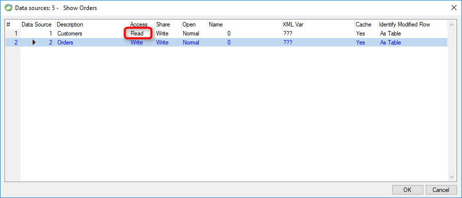

keywords: Datasource, Model , Table, Access, Read


Name in Migrated Code: **ReadOnly**  
Location in Migrated Code: **Class** (in Model region)  



## Migrated Code Example 

Example:
```csdiff
readonly Models.Customers Customers = new Models.Customers 
{ 
+        ReadOnly = true 
};
```

## See Also :
* [ReadOnly Property](http://www.fireflymigration.com/reference/html/P_Firefly_Box_Data_Entity_ReadOnly.htm) 

