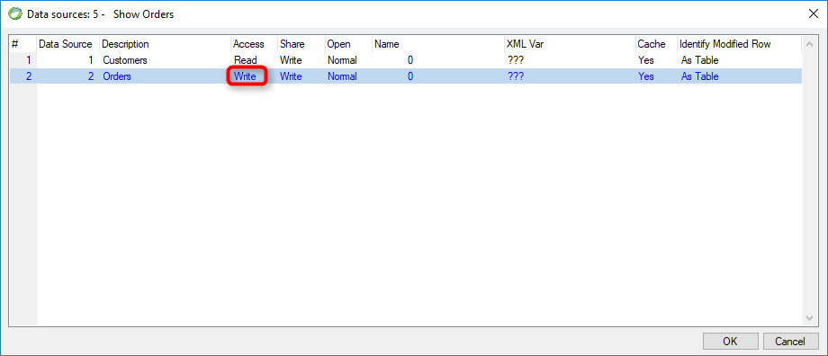

keywords: Datasource, Model , Table, Access, write


Name in Migrated Code: **AllowRowLocking**  
Location in Migrated Code: **Class** (in Model region)  



## Migrated Code Example 

Example:
```csdiff
internal readonly Models.Orders Orders = new Models.Orders
{ 
+        AllowRowLocking = true
};
```

## See Also :
* [AllowRowLocking Property](http://www.fireflymigration.com/reference/html/P_Firefly_Box_Data_Entity_AllowRowLocking.htm) 

