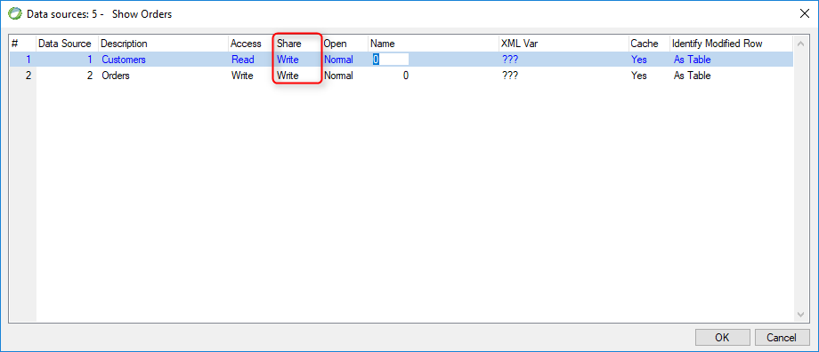

keywords: Datasource, Model , Table, Share, Write, Read, None


Name in Migrated Code: **FileSharing**  
Location in Migrated Code: **Model Initializer** 



## Migrated Code Example 

```csdiff
readonly Models.Customers Customers = new Models.Customers
{ 
+        FileSharing = ENV.Data.DataProvider.BtrieveFileSharing.Read 
};
```

## Property Values

| Magic Value| Migrated Code Value     |
|------------|-------------------------|
| Write      | BtrieveFileSharing.Write|
| Read       | BtrieveFileSharing.Read |
| None       | BtrieveFileSharing.None |

The default is BtrieveFileSharing.Write


